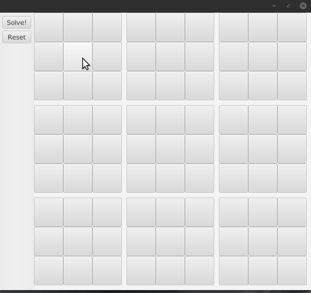

# Kotlin Sudoku Solver

This is a Sudoku game solver built with [Kotlin](https://kotlinlang.org/).

Currently, two algorithms implementations are available: my own [branch-and-bound implementation](https://en.wikipedia.org/wiki/Branch_and_bound) as well as one powered by [ojAlgo](https://github.com/optimatika/ojAlgo).

The UI was built with [TornadoFX](https://github.com/edvin/tornadofx).

